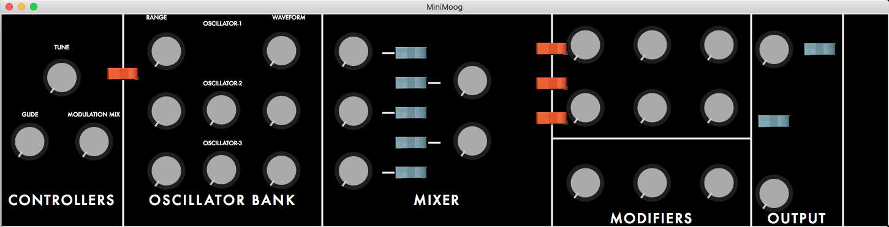

<h1>Minimoog GUI build using JUCE Framework</h1>

This is my first project using the JUCE Framework. The project is my best effort at recreating the control panel for the famous Moog Minimoog synthesizer. The panel is currently in a rought state that resembles the origin Minimoog design and this repo will track the changes that I have made.

Eventually, I the GUI will be used to implement a complete recreation of the Minimoog synthesizer that can be used as a standalone application or VST/AU plugin. Feel free to use as you like. Let me know if you have any questions or advice. :)

<h3>Current Look of the project from March 29 commit</h3>

<h3>Minimoog original front control panel</h3>

